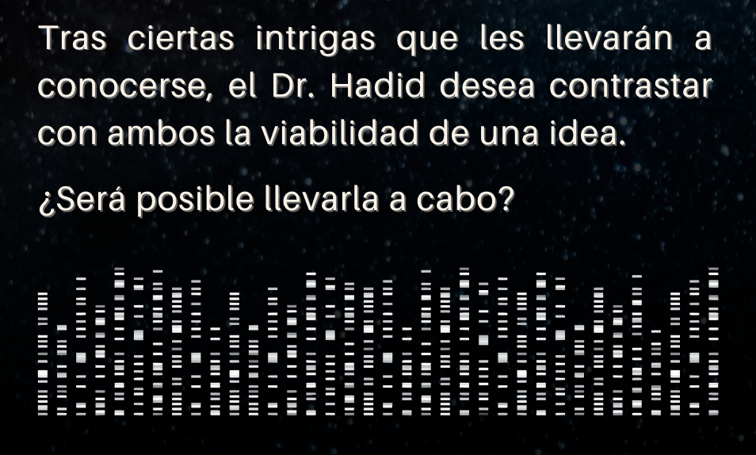

# text-to-dna
En el contexto de la integración contínua de mi novela «Mutagénesis Convergente», me plantee hacer una secuencia de ADN para acompañar a la sinopsis en la contracubierta. Algo así.

Yo había visto esa secuenciación en una imagen, pero claro, pensé ¿y si en dicha secuencia escribiese yo mi propio mensaje? Y ahí me puse a pensar…

## Codificación del ADN
Sabemos, que el código genético está formado por un alfabeto de cuatro letras llamadas nucleótidos.
A: Adenosina
G: Guanina
C: Citosina
T: Timina

En los ribosomas se lee, y cada tres nucleótidos añade un aminoácido, dando lugar a las proteínas. A estas tripletas de nucleótidos se les llama codones. Cada códón tiene su equivalencia a un aminoácido

## Tabla de aminoácidos
Existen 20 aminoácidos

| Letra | Abreviatura | Aminoácido      | Codones            |
| ----- | ----------- | --------------- | ------------------ |
| A     | Ala         | Alanina         | GCT, GCC, GCA, GCG |
| B     | -           | -               | -                  |       
| C     | Cys         | Cisteína        | TGT, TGC           |
| D     | Asp         | Ácido Aspártico | GAT, GAC           | 
| E     | Glu         | Ácido Glutámico | GAA, GAG           |
| F     | Phe         | Fenilalanina    | TTT, TTC           |
| G     | Gly         | Glicina         | GGT, GGC, GGA, GGG |
| H     | His         | Histidina       | CAT, CAC           |
| I     | Ile         | Isoleucina      | ATT, ATC, ATA      |
| J     | -           | -               | -                  |
| K     | Lys         | Lisina          | AAA, AAG           |
| L     | Leu         | Leucina         | CTT, CTC, CTA, CTG |
| M     | Met         | Metionina       | ATG                |
| N     | Asn         | Asparagina      | AAT, AAC           |
| O     | -           | -               | -                  |
| P     | Pro         | Prolina         | CCA, CCT, CCG, CCC |  
| Q     | Gln         | Glutamina       | CAG, CAA           | 
| R     | Arg         | Arginina        | AGA, AGG, CGT, CGC, CGA, CGG |
| S     | Ser         | Serina          | TCT, TCC, TCA, TCG, AGT, AGC |
| T     | Thr         | Treonina        | ACT, ACA, ACC, ACG |
| U     | -           | -               | -                  |
| V     | Val         | Valina          | GTA, GTG, GTT, GTC | 
| W     | Trp         | Triptófano      | TGG                |
| X     | -           | -               | -                  |
| Y     | Tyr         | Tirosina        | TAT, TAC           |
| Z     | -           | -               | -                  |

Como véis los 20 aminoácidos proyectan codones sobre una letra, pero hay 6 que no están: B, J, O, U, X y Z. Lo que se hace es repartir los codones de sus predecesores con ellos. Y para el caracter «espacio» voy a usar un codón de la serina AGC. De esta forma

| Letra | Abreviatura | Aminoácido      | Codones            |
| ----- | ----------- | --------------- | ------------------ |
| B     | -           | Alanina (2)     | GCA, GCG           |       
| J     | -           | Isoleucina (2)  | ATA                |
| O     | -           | Asparagina (2)  | AAC                |
| U     | -           | Treonina (2)    | ACC, ACG           | 
| X     | -           | Valina (2)      | GTT, GTC           |
| Z     | -           | Tirosina (2)    | TAC                |
| Esp   | -           | Serica   (2)    | AGC                |

Quedando la codificación al final:
| Letra | Abreviatura | Aminoácido      | Codones            |
| ----- | ----------- | --------------- | ------------------ |
| A     | Ala         | Alanina         | GCT, GCC           |
| B     | -           | Alanina (2)     | GCA, GCG           |      
| C     | Cys         | Cisteína        | TGT, TGC           |
| D     | Asp         | Ácido Aspártico | GAT, GAC           | 
| E     | Glu         | Ácido Glutámico | GAA, GAG           |
| F     | Phe         | Fenilalanina    | TTT, TTC           |
| G     | Gly         | Glicina         | GGT, GGC, GGA, GGG |
| H     | His         | Histidina       | CAT, CAC           |
| I     | Ile         | Isoleucina      | ATT, ATC           |
| J     | -           | Isoleucina (2)  | ATA                |
| K     | Lys         | Lisina          | AAA, AAG           |
| L     | Leu         | Leucina         | CTT, CTC, CTA, CTG |
| M     | Met         | Metionina       | ATG                |
| N     | Asn         | Asparagina      | AAT                |
| O     | -           | Asparagina (2)  | AAC                |
| P     | Pro         | Prolina         | CCA, CCT, CCG, CCC |  
| Q     | Gln         | Glutamina       | CAG, CAA           | 
| R     | Arg         | Arginina        | AGA, AGG, CGT, CGC, CGA, CGG |
| S     | Ser         | Serina          | TCT, TCC, TCA, TCG, AGT      |
| T     | Thr         | Treonina        | ACT, ACA           |
| U     | -           | Treonina (2)    | ACC, ACG           |
| V     | Val         | Valina          | GTA, GTG           | 
| W     | Trp         | Triptófano      | TGG                |
| X     | -           | Valina (2)      | GTT, GTC           |
| Y     | Tyr         | Tirosina        | TAT, TAC           |
| Z     | -           | Tirosina (2)    | TAC                |
| Esp   | -           | Serina (2)      | AGC                |

Ya estamos listos para codificar cualquier texto en cadenas de ADN
